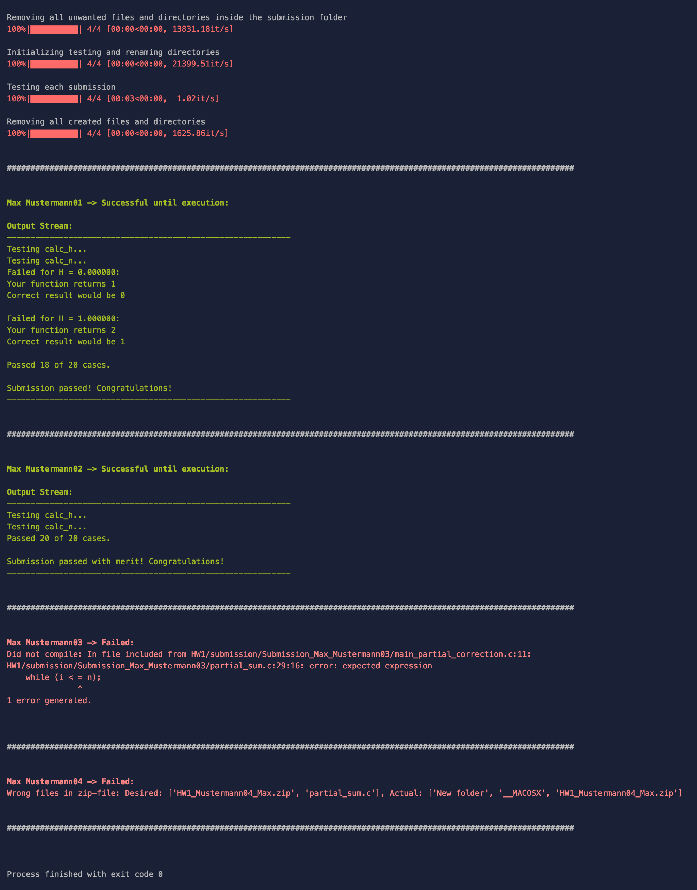

# IN8011 - Homework AutoCorrection

### New stuff 30.11.20

Optional line numbers in report for submission files.
Execution time is measured and shown in printout and report.
Configurable execution timeout (when the execution will be aborted).

```python
from src.main import Main
from configs.config_01 import config

if __name__ == "__main__":
    Main.run(config, timeout=15, line_numbers=True)
```

If you don't specify `timeout` or `line_numbers`, these will be the default values.

<br/>

### File Structure

Inside **`configs/`** you can find all configs for each homework.

Inside **`HW01/`** you can find an example for how the submission files have to be pasted in. These `*_assignsubmission_file_` files are the files you will get from moodle.

Inside **`examples/`** you can find an example for how the console- and the markdown-output might look like in homework 01.

<br/>

### Usage

1. Inside your desired `python3.7` environment run:

    ```bash
    pip install poetry
    poetry install
    pytest  # optional
    ```

2. Paste the submission you downloaded from moodle into `HW*/submissions`

3. Paste the given files into `HW*/given`

4. Select the correct config in `run.py`

5. Test all homework submissions with

    ```bash
    python3.7 run.py
    ```

6. Check the report at `reports/results_HW*.md`

<br/>

### Implementation - Configuration

Example configuration (from homework 06):

```python
config = {
    "HW_NUMBER": 6,

    # The file that the students were provided with
    "GIVEN_FILES": ["swap.h", "main_swap_correction.c"],

    # The files that are required to be in the submitted zip-file
    "SUBMISSION_FILES": ["swap.c"],

    # These are alle the files that should be compiled and linked together.
    # May not be equal to GIVEN_FILES + SUBMISSION_FILES. However all files
    # from GIVEN_FILES + SUBMISSION_FILES will be present in the directory
    # where the compilation takes place
    "COMPILATION_FILES": ["main_swap_correction.c", "swap.c"]
}
```

<br/>

### Implementation - Testing Procedure

The basic testing procedure:

1. Creating temporary test directories for each submission
2. Test 1: Is there exactly one zip-file?
3. Test 2: Does the zip-file contain all the required files?
4. Test 3: Does Compilation work as expected?
5. Execute the file and store the generated output
6. Removing all created files and directories
7. Generating a markdown protocol
8. Printing out the protocol

Only a short version of the test protocol will be printed out to the console. Example for HW1:


